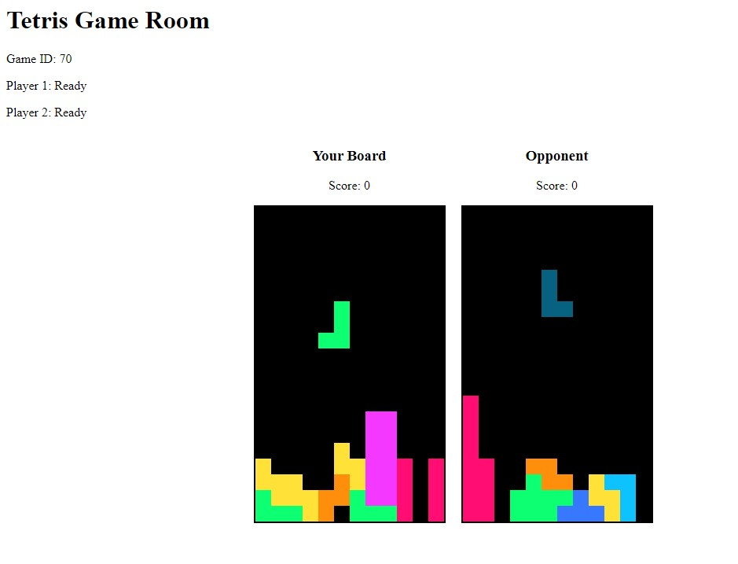

# Tetris Multiplayer

A real-time multiplayer Tetris game built with Node.js, Express, Socket.IO, and MariaDB.

## Description

This project implements a prototype multiplayer version of the classic Tetris game. Players can register, log in, join a lobby, create or join games, and play Tetris against each other in real-time. The game features a lobby system, player statuses, and live updates of opponent moves.

Please Note: This is currently a proof of concept and prototype. It is not ready for production deployment and may contain bugs. The primary goal of this project is to demonstrate the feasibility of a real-time multiplayer Tetris game and serve as a starting point for further development.

## Screenshots




## Features

- User registration and authentication
- Real-time game lobby
- Create and join games
- Live multiplayer Tetris gameplay
- Score tracking

## Tech Stack

- Backend:
  - Node.js
  - Express.js
  - Socket.IO
  - MariaDB
- Frontend:
  - JavaScript
  - HTML
  - Socket.IO Client
- DevOps:
  - Docker
  - Docker Compose

## Prerequisites

- Node.js (for local development)

## Installation

1. Clone the repository:
   ```bash
   git clone https://github.com/yourusername/tetris-multiplayer.git
   cd tetris-multiplayer
   ```

2. Create a `.env` file in the root directory and add the following environment variables:
   ```
   PORT=3000
   DB_HOST=mariadb
   DB_USER=root
   DB_PASSWORD=default
   DB_NAME=tetris
   JWT_SECRET=your_jwt_secret_key
   CORS_ORIGIN=http://localhost
   ```


## Database Setup

The project uses MariaDB. The database schema is included in the `tetris.sql` file. You can import this file into your MariaDB instance to set up the required tables.

## API Endpoints

- `POST /api/register`: Register a new player
- `POST /api/login`: Log in a player
- `GET /api/lobby`: Get the current lobby state
- `PUT /api/player/status`: Update player status
- `POST /api/game/create`: Create a new game
- `POST /api/game/join/:gameId`: Join an existing game
- `GET /api/game/by-player/:playerId`: Get game created by a specific player

## Socket.IO Events

- `login`: Emitted when a player logs in
- `joinGameRoom`: Join a specific game room
- `playerReady`: Indicate that a player is ready to start
- `playerMove`: Send player moves to the opponent
- `updateScore`: Update the player's score
- `gameOver`: Indicate that the game is over